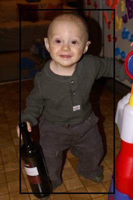
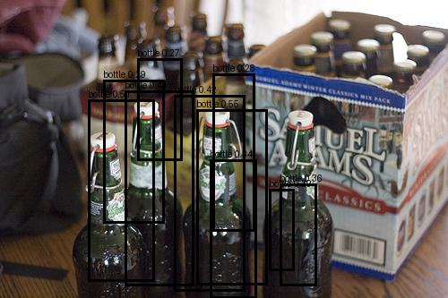
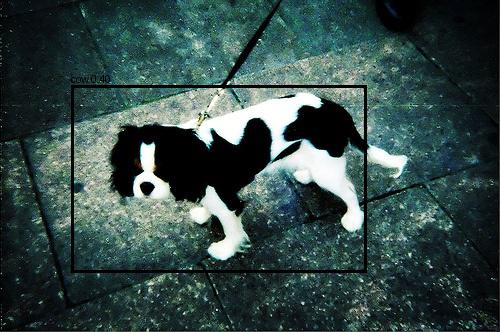
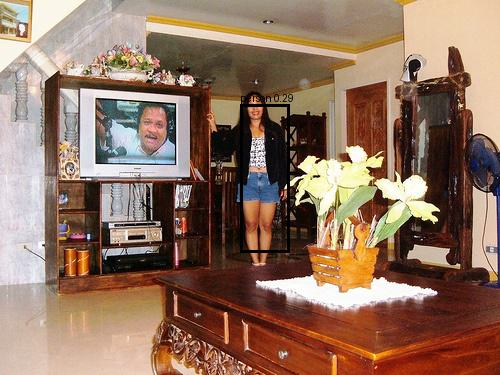
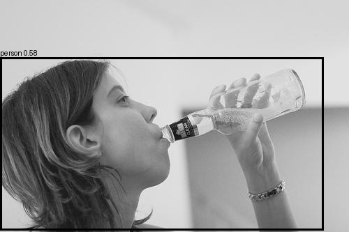
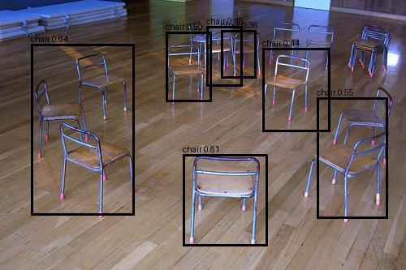
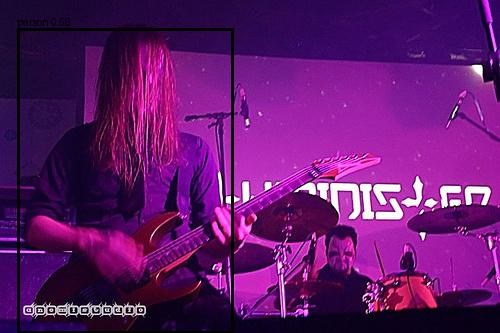
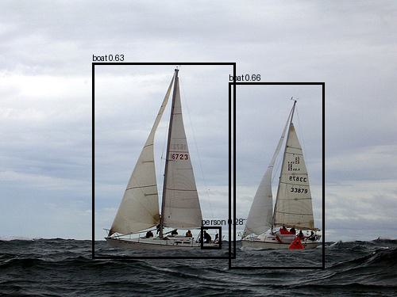
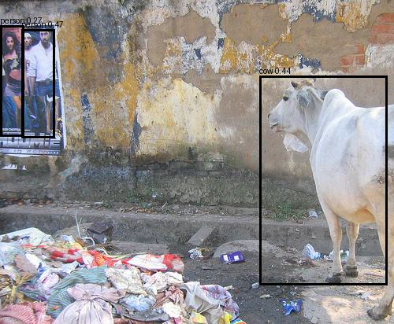

# YOLO

## YOLOv1：You Only Look Once: Unified, Real-Time Object Detection

### 1. 论文梳理

#### 1.1 数据集

PASCAL VOC 2007、PASCAL VOC 2012、the Picasso Dataset、People-Art Dataset

> VOC 2007是一个经典的目标检测数据集，包含20个类别，约5000张训练图像和5000张测试图像。VOC 2012是VOC 2007的扩展版本，包含更多的图像和注释，约11500张训练图像和11000张测试图像。Picasso Dataset和People-Art Dataset是两个艺术风格的目标检测数据集，分别包含约1000张图像。

#### 1.2 模型结构

24个卷积层 + 2个全连接层。卷积层包含三部分：7×7大卷积快速扩大感受野，捕获边缘、纹理、颜色块等低级特征；3×3与1×1卷积交替用于空间特征提取与降维等。Leaky ReLU引入非线性增强表达；MaxPool进行下采样。最后加入全连接层用于预测边界框和类别概率.

#### 1.3 创新点

##### 1.3.1 大杂烩损失函数

中心点位置损失:
$$
\lambda_{coord}\sum_{i=0}^{S^2}\sum_{j=0}^{B}1_{ij}^{obj}
[(x_i-\hat{x}_i)^2+(y_i-\hat{y}_i)^2]
$$

宽高尺寸，开根号为降低大框权重 / 提高小框敏感度:
$$
+\lambda_{coord}\sum_{i=0}^{S^2}\sum_{j=0}^{B}1_{ij}^{obj}
[(\sqrt{w_i}-\sqrt{\hat{w}_i})^2+(\sqrt{h_i}-\sqrt{\hat{h}_i})^2]
$$

存在物体时物体置信度：
$$
+\sum_{i=0}^{S^2}\sum_{j=0}^{B}
1_{ij}^{obj}(C_i-\hat C_i)^2
$$

没有物体时置信度约束：
$$
+\lambda_{noobj}\sum_{i=0}^{S^2}\sum_{j=0}^{B}
1_{ij}^{noobj}(C_i-\hat C_i)^2
$$

针对网格的分类误差：
$$
+\sum_{i=0}^{S^2}1_i^{obj}
\sum_{c\in classes}(p_i(c)-\hat p_i(c))^2
$$

##### 1.3.2 端到端目标检测

YOLOv1 将目标检测建模为一个回归问题，直接从图像像素到边界框坐标和类别概率的映射。相比传统的两阶段方法（如 R-CNN 系列），YOLOv1 通过单个神经网络实现端到端推理，显著提高了检测速度。

##### 1.3.3 Global Context 编码

论文将目标检测建模为全局回归问题，而不是局部候选框分类问题。

卷积层感受野覆盖整图，FC 层融合全局信息，所以每个grid cell不是独立看的，预测时“看的是整张图”，模型学到：物体之间关系、背景分布、场景结构.

##### 1.3.4 多项实验

YOLOv1的分析验证实验；YOLOv1 与 Fast R-CNN结合实验提高mAP值；人物数据集检测实验；实时性能测试与对比实验。

#### 1.4 评价指标

IoU（Intersection over Union）交并比：预测框与真实框的交集面积除以它们的并集面积。IoU ≥ 0.5 通常被视为正确检测。

mAP (mean Average Precision)：平均精度均值，衡量模型在所有类别上的检测性能。AP 是每个类别的平均精度，mAP 是所有类别 AP 的平均值。

### 2. 复现实验

本项目在 Pascal VOC2007与 VOC2012 数据集上复现并对比 YOLOv1 风格目标检测器，重点研究以下因素对检测性能的影响：

- 是否使用分类预训练；
- Darknet 与 ResNet34 主干网络的差异；
- 全连接检测头与卷积检测头的差异；
- 学习率策略对收敛速度和最终 mAP 的影响.

#### 2.1 网络架构与实验参数对比

| 模块       | 原始 YOLOv1（论文结构）      | 复现 YOLOv1                           |
| -------- | -------------------- | ------------------------------------------- |
| 输入       | 448×448×3            | 448×448×3                                   |
| Conv1    | 7×7, 64, s=2         | `Conv(7×7, 64, s=2, p=3) + BN + LeakyReLU`  |
| Pool1    | 2×2, s=2             | `MaxPool2d(2×2, s=2)`                       |
| Conv2    | 3×3, 192             | `Conv(3×3, 192, s=1, p=1) + BN + LeakyReLU` |
| Pool2    | 2×2, s=2             | `MaxPool2d(2×2, s=2)`                       |
| Conv3    | 1×1, 128             | `Conv(1×1, 128, s=1, p=0) + BN + LeakyReLU` |
| Conv4    | 3×3, 256             | `Conv(3×3, 256, s=1, p=1) + BN + LeakyReLU` |
| Conv5    | 1×1, 256             | `Conv(1×1, 256, s=1, p=0) + BN + LeakyReLU` |
| Conv6    | 3×3, 512             | `Conv(3×3, 512, s=1, p=1) + BN + LeakyReLU` |
| Pool3    | 2×2, s=2             | `MaxPool2d(2×2, s=2)`                       |
| Conv7-14 | (1×1,3×3)×4（512通道堆叠） | 8层 CNNBlock：`1×1/3×3 交替（256↔512）×4`         |
| Conv15   | 1×1, 512             | `Conv(1×1, 512)`                            |
| Conv16   | 3×3, 1024            | `Conv(3×3, 1024)`                           |
| Pool4    | 2×2, s=2             | `MaxPool2d(2×2, s=2)`                       |
| Conv17   | 1×1, 512             | `Conv(1×1, 512)`                            |
| Conv18   | 3×3, 1024            | `Conv(3×3, 1024)`                           |
| Conv19   | 1×1, 512             | `Conv(1×1, 512)`                            |
| Conv20   | 3×3, 1024            | `Conv(3×3, 1024)`                           |
| Conv21   | 3×3, 1024            | `Conv(3×3, 1024)`                           |
| Conv22   | 3×3, 1024 (s=2)      | `Conv(3×3, 1024, s=2)`                      |
| Conv23   | 3×3, 1024            | `Conv(3×3, 1024)`                           |
| Conv24   | 3×3, 1024            | `Conv(3×3, 1024)`                           |

论文复现过程中，加入了批次归一化（BatchNorm），以提升训练稳定性。论文中的backbone设计思想来自于VGG思想（深堆3×3）以及NIN（Network in Network）与GoogLeNet思想（1×1降维与学习）。

#### 2.2 实验过程

| 模块 | 原论文 YOLOv1 | 本项目 |
|---|---|---|
| 分类预训练数据 | ImageNet 1000 类 | Darknet：VOC 多标签预训练；ResNet34：ImageNet 预训练 |
| 检测训练数据 | VOC2007+VOC2012 train/val | VOC2007+VOC2012 train/val |
| 验证/测试数据 | VOC2007 test、VOC2012 test | VOC2007 test |
| Picasso/People-Art | 仅用于跨域泛化评估，不参与训练 | 未进行 |
| 输入尺寸 | 448×448 | 448×448 |
| Grid | `S=7, B=2, C=20` | `S=7, B=2, C=20` |
| 原始主干 | 24 个卷积层 | YOLOv1 版：24 层 Darknet-like（另做了ResNet34） |
| 分类预训练结构 | 前 20 个卷积层，224×224 ImageNet 分类预训练 | Darknet VOC 分类预训练（另加载torchvision ResNet34 权重） |
| 检测网络 | 24 Conv + 2 FC | Darknet/ResNet34 + FC/CNN head |
| Dropout | FC 检测头使用 0.5 | FC head 使用 0.5；CNN head 不使用 |
| 输出 | 7×7×30 | 7×7×30 |
| 分类损失 | MSE | MSE |
| 坐标损失 | MSE，宽高使用平方根误差 | 基本一致 |
| confidence 目标 | responsible box 与 GT 的 IoU | 一致 |
| `λ_coord` | 5 | 5 |
| `λ_noobj` | 0.5 | 0.5 |
| 优化器 | SGD，momentum 0.9 | SGD，momentum 0.9 |
| weight decay | `5e-4` |  `5e-4` |
| batch size | 64 | 64（8时valloss震荡幅度很大） |
| epochs | 135 | 因实验不同为 100～250 |
| 原论文 LR | warmup：`1e-3 → 1e-2` | 多组自定义 schedule |
| 原论文 LR 阶段 | `1e-2` 训练75轮，`1e-3` 训练30轮，`1e-4` 训练30轮 | 实验中使用过 `1e-5～5e-3` |
| NMS | 使用 | 使用，默认阈值约0.5 |
| 检测判定 IoU | VOC AP@0.5 | mAP@0.5 |
| mAP 算法 | VOC 官方评估 | 当前为连续 PR 积分，并非严格 VOC2007 11点法 |
| difficult 目标 | VOC 官方评估忽略 difficult | 最终评估已按官方规则忽略 |
| 论文结果 | VOC07 mAP 63.4% | 改造模型当前最好约71.43% |
| 速度 | 45 FPS | 未做 |

##### 2.2.1 实验一：从零训练 Darknet + FC 检测头

| 模块 | 原论文 YOLOv1 | 实验一 |
|---|---|---|
| 分类预训练数据 | ImageNet 1000 类 | 无预训练 |
| batch size | 64 | 64（8时valloss震荡幅度很大） |
| epochs | 135 | 因实验不同为 100～250 |
| 原论文 LR | warmup：`1e-3 → 1e-2` | 无 |
| 原论文 LR 阶段 | `1e-2` 训练75轮，`1e-3` 训练30轮，`1e-4` 训练30轮 | 初始`1e-5`，后调整`1e-4`，也尝试`1e-3` |
| 论文结果 | VOC07 mAP 63.4% | 约6% |

（1）该实验不使用任何预训练，网络结构为上述 **复现 YOLOv1** 结构，Darknet 主干和检测头同时从随机初始化开始学习。

（2）主要表现：

- train loss 持续下降，val loss 震荡严重，mAP 增长很慢，最终停留在 0.06 左右；
- object confidence 长期偏低；
- 预测结果包含大量低置信度假阳性和重复框；

（3）模型需要同时学习视觉特征、类别语义和目标定位，学习任务多，小模型难以兼顾（100-150epochs）。

##### 2.2.2 实验二：ResNet34 ImageNet 预训练 + FC 检测头

| 模块 | 原论文 YOLOv1 | 实验二 |
|---|---|---|
| 分类预训练数据 | ImageNet 1000 类 |ResNet34：ImageNet 预训练 |
| 原始主干 | 24 个卷积层 | ResNet34结构|
| 分类预训练结构 | 前 20 个卷积层，224×224 ImageNet 分类预训练 | 直接加载torchvision ResNet34 权重 |
| 检测网络 | 24 Conv + 2 FC | ResNet34 + FChead |
| epochs | 135 | 250 |
| 原论文 LR | warmup：`1e-3 → 1e-2` | 多组自定义 schedule |
| 原论文 LR 阶段 | `1e-2` 训练75轮，`1e-3` 训练30轮，`1e-4` 训练30轮 | 预热 `1e-5`、`1e-4` 、`5e-4`、`1e-3`、`1e-4`|
| 论文结果 | VOC07 mAP 63.4% | 训练期间记录约42%；最终统一评估为61.07% |

（1）此实验目的是为了验证实验过程中的参数无误，尤其是LOSS的正确性，所以直接使用 torchvision ImageNet 预训练 ResNet34，并保留 YOLOv1 风格全连接检测头。

（2）训练早期曾因为学习率过低而停留在 `0.18~0.20`。逐步把后期学习率从 `1e-5` 提升到 `1e-4`、`5e-4` 和 `1e-3` 后，模型重新开始有效学习，最终达到约 `0.42`。

##### 2.2.3 实验三：Darknet VOC 分类预训练 + FC 检测头

| 模块 | 原论文 YOLOv1 | 实验一 | 实验三 | 实验二 |
|---|---|---|---|---|
| 分类预训练数据 | ImageNet 1000类 | 无预训练 | VOC多标签预训练 | ImageNet预训练 |
| 分类预训练结构 | 前20个卷积层，224×224 ImageNet分类预训练 | 无 | Darknet VOC分类预训练 | 直接加载torchvision ResNet34权重 |
| 主干网络 | 24个卷积层 | Darknet | Darknet | ResNet34 |
| 检测网络 | 24 Conv + 2 FC | Darknet + FC head | Darknet + FC head | ResNet34 + FC head |
| Epochs | 135 | 100～150 | 150～200 | 250 |
| LR warmup | `1e-3 → 1e-2` | 初始`1e-5`，后调整到`1e-4` | `1e-5 → 1e-4` | `1e-5 → 1e-4` |
| LR阶段 | `1e-2`训练75轮，`1e-3`训练30轮，`1e-4`训练30轮 | 尝试`1e-4`和`1e-3` | `1e-4 → 5e-4 → 1e-3 → 1e-4` | `1e-4 → 5e-4 → 1e-3 → 1e-4` |
| 训练期间记录 | VOC07 mAP 63.4% | 约6% | 约32.1% | 约42% |

1. 在验证了实验参数的有效性后，继续复现YOLOv1，以此与实验一进行对照，证明预训练的重要性。首先使用 VOC2007+VOC2012 对 Darknet 做多标签分类预训练，再加载主干权重训练 YOLOv1 检测器。分类预训练最高 Cls mAP 约为0.50；训练期间记录的检测 mAP50 约为 0.321，最终按 difficult 忽略规则统一评估为 0.4853。

2. 该结果明显突破从零训练的 `0.06` 平台，说明即使只使用规模较小的 VOC 做分类预训练，也能显著改善主干网络初始化。但 VOC 分类特征的上限仍明显低于 ImageNet 预训练特征。这主要是因为 VOC 仅包含 20 个类别，且图像数量远少于 ImageNet，导致主干网络学习到的特征不够丰富和泛化。

##### 2.2.4 实验四与实验五：改造检测头为 CNN 结构

| 模块 | 原论文 YOLOv1 | 实验一 | 实验三 | 实验四 | 实验二 | 实验五 |
|---|---|---|---|---|---|---|
| 分类预训练数据 | ImageNet 1000类 | 无预训练 | VOC多标签预训练 | VOC多标签预训练 | ImageNet预训练 | ImageNet预训练 |
| 分类预训练结构 | 前20个卷积层，224×224 ImageNet分类预训练 | 无 | Darknet VOC分类预训练 | 加载已训练Darknet主干 | 直接加载torchvision ResNet34权重 | 加载已训练ResNet34主干 |
| 主干网络 | 24个卷积层 | Darknet | Darknet | Darknet | ResNet34 | ResNet34 |
| 检测头 | 2层FC | FC head | FC head | CNN head | FC head | CNN head |
| Epochs | 135 | 100～150 | 约170 | 约100 | 250 | 约120 |
| LR warmup | `1e-3 → 1e-2` | 初始`1e-5`，后调整到`1e-4` | `1e-4 → 1e-3` | `1e-4 → 1e-3` | `1e-5 → 1e-4` | `1e-5 → 1e-4` |
| LR阶段 | `1e-2`训练75轮，`1e-3`训练30轮，`1e-4`训练30轮 | 尝试`1e-4`和`1e-3` | `1e-3 → 1e-4` | `1e-4 → 1e-3 → 1e-4` | `1e-4 → 5e-4 → 1e-3 → 1e-4` | `1e-4 → 1e-3 → 5e-3 → 1e-4` |
| 训练期间记录 | VOC07 mAP 63.4% | 约6% | 约32.1% | 约34.7% | 约42% | 约49.4% |

（1）CNN 检测头的主要优势是保留了网格空间对应关系，能够更好地利用卷积特征图的空间信息，从而提升检测性能。而 FC 检测头则将空间信息压缩为全连接层，可能导致空间信息的丢失。github上有一些 YOLOv1 的改进版本也采用了 CNN 检测头，取得了更好的性能。

（2）训练期间记录表明，使用 CNN 检测头的模型在收敛速度和性能上总体优于 FC 检测头。最终统一评估进一步确认：Darknet 的 CNN 检测头比 FC 检测头提升 2.38 个百分点，ResNet34 的 CNN 检测头比 FC 检测头提升 10.36 个百分点。

#### 2.3 实验结果与分析

##### 2.3.1 训练过程结果汇总

| 模块 | 原论文 | 实验一 | 实验三 | 实验四 | 实验二 | 实验五 |
|---|---|---|---|---|---|---|
| 主干网络 | Darknet | Darknet | Darknet | Darknet | ResNet34 | ResNet34 |
| 预训练 | ImageNet | 无 | VOC预训练 | VOC预训练 | ImageNet预训练 | ImageNet预训练 |
| 检测头 | FC head | FC head | FC head | CNN head | FC head | CNN head |
| 最终 mAP@0.50 | **0.634** | 0.060* | 0.4853 | 0.5091 | 0.6107 | **0.7143** |

分析：

1. 预训练是影响 YOLOv1 收敛和最终性能的关键因素。
2. VOC 分类预训练可以打破从零训练停滞，但不如大规模 ImageNet 预训练。
3. CNN 检测头保留网格空间对应关系，收敛速度和最终性能均优于 FC 检测头。
4. ResNet34+CNN 是当前五组实验中表现最好的组合。
5. 高质量主干特征带来的收益大于单独更换检测头，但主干和检测头的改进可以叠加。

其中实验一的 `0.060` 为早期训练记录，未按当前最终评估流程重新测试。实验二至实验五均已在 VOC2007 test 上按官方规则忽略 difficult 目标。实验五采用 ResNet34 与 CNN 检测头，其 `0.7143` 高于原论文数值，但它不是原始 YOLOv1 结构；同时当前 AP 使用连续 PR 积分而非 VOC2007 11 点法，因此不能直接表述为原始 YOLOv1 复现超过论文。

##### 2.3.2 统一评估结果

为保证不同实验之间可比较，最终模型统一使用同一套评估脚本，在 `VOCDetection(year="2007", image_set="test")` 对应的 **PASCAL VOC 2007 test** 全部 4952 张图像上重新计算 `AP@0.50` 和 `mAP@0.50`。这里记录的是加载指定最佳检查点后完成整套测试集评估得到的结果，不等同于训练日志中间隔若干 epoch 记录的历史 mAP（验证集）。

实验二至实验五均在 VOC2007 test 上完成评估，并按 VOC 官方规则忽略 `difficult` 目标。

| 指标/类别 | 原论文 YOLOv1 | 实验二 | 实验三 | 实验四 | 实验五 |
|---|---:|---:|---:|---:|---:|
| 主干网络 | 24 Conv | ResNet34 | Darknet | Darknet | ResNet34 |
| 预训练 | ImageNet | ImageNet | VOC 多标签分类 | VOC 多标签分类 | ImageNet |
| 检测头 | FC head | FC head | FC head | CNN head | CNN head |
| Ignore difficult | True | **True** | **True** | **True** | **True** |
| 评估检查点 | 论文报告值 | `best_resnet_yolo_fc_head.pth` | `best_yolov1_fc_head.pth` | `best_yolov1_cnn_head.pth` | `best_resnet_yolo_cnn_head.pth` |
| **mAP@0.50** | **0.6340** | **0.6107** | **0.4853** | **0.5091** | **0.7143** |
| aeroplane | — | 0.6376 | 0.5879 | 0.6163 | **0.7363** |
| bicycle | — | 0.7570 | 0.6455 | 0.6721 | **0.8389** |
| bird | — | 0.6037 | 0.3723 | 0.3762 | **0.7098** |
| boat | — | 0.4542 | 0.3168 | 0.3284 | **0.5955** |
| bottle | — | 0.2146 | 0.0417 | 0.0639 | **0.3944** |
| bus | — | 0.7122 | 0.5919 | 0.6434 | **0.8110** |
| car | — | 0.6631 | 0.6159 | 0.6436 | **0.7961** |
| cat | — | 0.8576 | 0.6698 | 0.6836 | **0.8783** |
| chair | — | 0.3355 | 0.2160 | 0.2269 | **0.5202** |
| cow | — | 0.5791 | 0.4196 | 0.4326 | **0.6988** |
| diningtable | — | 0.5767 | 0.4776 | 0.5343 | **0.6574** |
| dog | — | 0.8346 | 0.6081 | 0.5948 | **0.8562** |
| horse | — | 0.8016 | 0.7395 | 0.7425 | **0.8400** |
| motorbike | — | 0.7046 | 0.6101 | 0.6488 | **0.8104** |
| person | — | 0.5650 | 0.5306 | 0.5357 | **0.7069** |
| pottedplant | — | 0.2481 | 0.1398 | 0.1729 | **0.4269** |
| sheep | — | 0.6044 | 0.4661 | 0.4967 | **0.7779** |
| sofa | — | 0.6967 | 0.5275 | 0.5545 | **0.6991** |
| train | — | 0.7651 | 0.6855 | 0.7170 | **0.8449** |
| tvmonitor | — | 0.6037 | 0.4429 | 0.4974 | **0.6866** |

在相同主干、预训练及 difficult 忽略规则下，CNN 检测头在 Darknet 上将 mAP@0.50 从 `0.4853` 提升至 `0.5091`，提升 2.38 个百分点；在 ResNet34 上则从 `0.6107` 提升至 `0.7143`，提升 `0.1036`，即 10.36 个百分点。实验五在全部 20 个类别上均取得最高 AP，但 `bottle`、`pottedplant`、`chair` 和 `boat` 仍是相对较弱的类别。

实验五的 `0.7143` 在数值上高于原论文报告的 `0.634`。不过，本项目采用 ResNet34 与 CNN 检测头，并使用连续 PR 积分，而非原论文网络及严格的 VOC2007 11 点 AP，因此该结果代表改造模型的实验性能，不能表述为原始 YOLOv1 复现精度超过论文。

##### 2.3.3 示例图——0.25的置信度阈值

1. yolov1_cnn_head:

    

2. resnet_yolo_cnn_head:

     

##### 2.3.4 实验中的问题与考虑

（1）学习率的问题

对于从零训练且无预训练的模型，早期使用较高的学习率会使模型震荡，较低的学习率（如 `1e-5`）虽然会使训练过程稳定，但会导致模型收敛缓慢，甚至陷入局部最优。所以需要及时调整学习率策略，尤其是在训练后期。

对于使用预训练的模型，学习率的选择同样重要。过高的学习率可能会破坏预训练权重，而过低的学习率可能会导致模型无法充分利用预训练特征。因此，在使用预训练模型时，刚开始采用较小的初始学习率，并根据验证集性能动态调整。

（2）batch size 的问题

早期实验中使用较小的 batch size（如 8）会导致验证集 loss 震荡幅度较大，影响模型的稳定性和收敛速度。使用较大的 batch size（如 64），会获得更稳定的梯度估计和更好的训练效果。

（3）小目标与密集目标检测

模型在单个、大目标场景中表现较好，例如 bus、dog 等；在多人、小目标和拥挤场景中仍存在漏检、重复框和类别混淆。这是因为 YOLOv1 `7x7` 单尺度网格小目标空间信息不足、同一网格中的多个目标会竞争责任，后期可以考虑金字塔网络进行多尺度特征融合。

### 3. 总结

本次围绕原始论文 YOLOv1 进行了复现实验，总共进行了五组实验，主要研究了预训练、主干网络和检测头对模型性能的影响。实验结果表明：在面临多项任务时，简单的网络难以兼顾，很可能在初始阶段罢工，实验证明预训练是解决这一问题的关键，而且在Fast R-CNN等论文中，预训练或者交替训练被广泛采用。CNN 检测头保留了空间对应关系，收敛速度和最终性能均优于 FC 检测头。ResNet34+CNN 是当前五组实验中表现最好的组合。

目前YOLO已演化出十多个版本，后续将通过预训练模型、金字塔网络或者U型网络的多尺度融合等方法进一步提升性能。

### 附：项目结构与使用

#### 1. 模型组合

当前支持两种主干网络：

- `yolov1`：YOLOv1 风格 Darknet 主干网络；
- `resnet_yolo`：使用 torchvision ImageNet 预训练 ResNet34 作为主干网络。

支持两种检测头：

- `fc_head`：原始 YOLOv1 风格全连接检测头；
- `cnn_head`：保留空间对应关系的卷积检测头。

在 `config.py` 中切换组合：

```python
MODEL_NAME = "resnet_yolo"
DETECTION_HEAD = "cnn_head"
```

可组成四种主要结构：

```text
yolov1      + fc_head
yolov1      + cnn_head
resnet_yolo + fc_head
resnet_yolo + cnn_head
```

#### 2. 项目结构

共享代码：

```text
utils/dataset.py       VOC 数据读取和标签编码
utils/loss.py          YOLOv1 损失函数
utils/metrics.py       解码、NMS 和 mAP 评估
utils/checkpoint.py    权重加载和模型解包
train.py               检测训练入口
pretrain.py            Darknet VOC 多标签分类预训练
eval_map.py            独立 mAP 评估
predict.py             检测结果可视化
```

模型代码：

```text
model/yolov1.py        Darknet、分类器和 YOLOv1 检测模型
model/resnet_yolo.py   ResNet34 YOLO 检测模型
model/factory.py       模型创建入口
```

#### 3. 输出目录

建议使用主干网络和检测头共同组成实验名称，防止不同实验互相覆盖：

```python
EXPERIMENT_NAME = f"{MODEL_NAME}_{DETECTION_HEAD}"
```

对应目录：

```text
checkpoints/yolov1_fc_head/
checkpoints/yolov1_cnn_head/
checkpoints/resnet_yolo_fc_head/
checkpoints/resnet_yolo_cnn_head/

logs/yolov1_fc_head/
logs/yolov1_cnn_head/
logs/resnet_yolo_fc_head/
logs/resnet_yolo_cnn_head/
```

#### 4. 运行方法

Darknet VOC 分类预训练：

```bash
python pretrain.py --epochs 50 --lr 1e-3 --batch-size 32
```

检测训练：

```bash
python train.py
```

mAP 评估和预测可视化：

```bash
python eval_map.py
python predict.py
```

#### 5. 权重初始化与续训

首次更换检测头时，只加载旧模型的主干网络，新的检测头随机初始化：

```python
RESUME = False
BACKBONE_INIT_PATH = os.path.join(
    CHECKPOINT_ROOT,
    "resnet_yolo",
    "best_resnet_yolo.pth",
)
```

后续继续同一个实验时，完整恢复模型、优化器和 epoch，修改：

```python
RESUME = True
```
